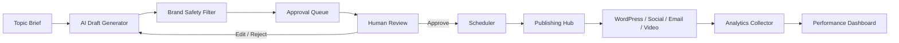

# Camelot Content Distribution Engine Architecture

## Stack Choice

Camelot OS is currently a React/Vite application deployed on Render as a static/client-first dashboard with local workflow simulators. For the Content Distribution Engine, the safest near-term architecture is:

- Frontend: React inside Camelot OS V10 for content review, approval, calendar, analytics, and integration health.
- Shared rules/data layer: TypeScript modules in `src/lib` for content models, channel rules, cadence, and brand safety constraints.
- Backend phase: Node/Fastify or Python/FastAPI can be added behind the dashboard when publishing credentials are available. Either works, but Python/FastAPI is recommended for AI/content workflows, scheduled jobs, analytics pulls, and future NLP evaluation.
- Database phase: PostgreSQL for content library, approval states, audit logs, and analytics; Redis for queueing and scheduled publishing.
- Queue phase: Celery if FastAPI is selected, or BullMQ if a Node backend is selected.

This keeps the current Camelot OS deployment stable while making the content bot visible now. It also avoids putting WordPress, Facebook, LinkedIn, Mailchimp, or OAuth credentials in frontend code.

## Data Flow

## Non-Negotiable Gates

- No auto-publishing. Every content item must pass human approval.
- David's personal cell phone number must never appear in generated content, posts, emails, CTAs, or signatures.
- Public content must not disclose specific client financials unless explicitly approved.
- Public content must not attack competitor firms by name.
- Legal or compliance content must be framed as informational and refer readers to counsel where appropriate.
- Every state change must be logged with actor, timestamp, old status, new status, and destination platform.

## Current Implementation

Phase 1 lives in:

- `src/pages/ContentEngine.tsx`
- `src/lib/content-engine.ts`

It includes:

- Content generation intake
- Approval queue
- Human approval/schedule actions
- Weekly channel cadence
- Brand safety rules
- Integration map
- Analytics snapshot
- Downloadable content plan export
- Copyable system prompt
- Six module definitions: SEO and GBP Content Engine, LinkedIn Content Drafter, Content Distribution Engine, Content Dashboard, Cold Calling and Outreach, and CTA Plans
- Review routing for David, Beth, Sam, and Valerie
- Brand identity tokens, approved contact block, and source-image rules
- CTA matrix by topic type
- Backend database contract for `content`, `keywords`, `distributed_posts`, `engagement_metrics`, `approvals`, `leads`, and `run_log`

## Module Responsibilities

1. SEO and GBP Content Engine: weekly Wednesday research and draft package for long-form articles, GBP posts, X/Buffer copy, SEO HTML, real-image sourcing, Google Docs, WordPress draft attempts, and approval emails.
2. LinkedIn Content Drafter: weekly Friday package for David's personal profile plus Sam's manual company page and Facebook copy.
3. Content Distribution Engine: twice-weekly approval scan, approved publishing, manual-paste packaging, confirmation emails, and engagement tracking.
4. Content Dashboard: daily calendar, keyword tracker, content inventory, topic dedupe view, run history, Google Sheet sync, and summary email.
5. Cold Calling and Outreach: building-lead queue, public-source triggers, contact enrichment, tailored call scripts, follow-up sequences, and HubSpot/AppFolio handoff.
6. CTA Plans: dynamic call-to-action selection by content type while enforcing approved Camelot contact details.

## Editorial Rules

- Long-form content should read like investigative/editorial real estate writing, not generic marketing copy.
- Camelot positioning should be woven into the narrative; do not add a dedicated "How Camelot Handles This" section.
- Use real source images first, with attribution. AI-generated images are fallback only and must be labeled as illustrations.
- Deduplicate keywords and topics across a four-week window.
- Use `Camelot Property Management` as the public company name, with `Camelot Brokerage Services Corp.` referenced where leasing or sales is relevant.
- David's personal cell number must never be generated. Use the approved office number and extension only.

## WordPress And Social Notes

The frontend tracks WordPress, LinkedIn, Facebook, Instagram, X/Buffer, Google Business Profile, Gmail, Google Sheets, Mailchimp, HubSpot, and vendor integrations as capability records. Actual credentialed publishing should be implemented server-side.

The current WordPress posture assumes WP Engine / WordPress access may require browser-assisted draft creation or manual review when REST application passwords are unavailable. The dashboard should still produce a complete Google Doc, HTML draft, SEO metadata, source links, and approval package so the work is not blocked by WordPress automation.

## Backend Expansion Plan

1. Add a credentialed backend service with encrypted environment variables.
2. Add PostgreSQL tables for content items, calendar entries, analytics records, audit events, and platform tokens.
3. Add publishing adapters for WordPress REST, Facebook Graph, LinkedIn, Instagram, X, Mailchimp, YouTube, and TikTok.
4. Add retry/backoff and platform-specific rate limit handling.
5. Add GA4/social/email analytics collectors.
6. Add weekly optimization jobs for content gaps, posting times, and SEO rank tracking.

## Security Notes

Publishing credentials should never be stored in the browser bundle. OAuth refresh tokens, WordPress app passwords, Mailchimp keys, OpenAI keys, and analytics service account credentials belong in the backend environment or encrypted vault only.
