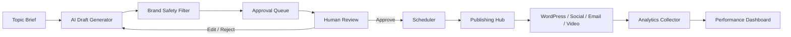

# Camelot Content Distribution Engine Architecture

## Stack Choice

Camelot OS is currently a React/Vite application deployed on Render as a static/client-first dashboard with local workflow simulators. For the Content Distribution Engine, the safest near-term architecture is:

- Frontend: React inside Camelot OS V10 for content review, approval, calendar, analytics, and integration health.
- Shared rules/data layer: TypeScript modules in `src/lib` for content models, channel rules, cadence, and brand safety constraints.
- Backend phase: Node/Fastify or Python/FastAPI can be added behind the dashboard when publishing credentials are available. Either works, but Python/FastAPI is recommended for AI/content workflows, scheduled jobs, analytics pulls, and future NLP evaluation.
- Database phase: PostgreSQL for content library, approval states, audit logs, and analytics; Redis for queueing and scheduled publishing.
- Queue phase: Celery if FastAPI is selected, or BullMQ if a Node backend is selected.

This keeps the current Camelot OS deployment stable while making the content bot visible now. It also avoids putting WordPress, Facebook, LinkedIn, Mailchimp, or OAuth credentials in frontend code.

## Data Flow

## Non-Negotiable Gates

- No auto-publishing. Every content item must pass human approval.
- David's personal cell phone number must never appear in generated content, posts, emails, CTAs, or signatures.
- Public content must not disclose specific client financials unless explicitly approved.
- Public content must not attack competitor firms by name.
- Legal or compliance content must be framed as informational and refer readers to counsel where appropriate.
- Every state change must be logged with actor, timestamp, old status, new status, and destination platform.

## Current Implementation

Phase 1 lives in:

- `src/pages/ContentEngine.tsx`
- `src/lib/content-engine.ts`

It includes:

- Content generation intake
- Approval queue
- Human approval/schedule actions
- Weekly channel cadence
- Brand safety rules
- Integration map
- Analytics snapshot
- Downloadable content plan export
- Copyable system prompt

## Backend Expansion Plan

1. Add a credentialed backend service with encrypted environment variables.
2. Add PostgreSQL tables for content items, calendar entries, analytics records, audit events, and platform tokens.
3. Add publishing adapters for WordPress REST, Facebook Graph, LinkedIn, Instagram, X, Mailchimp, YouTube, and TikTok.
4. Add retry/backoff and platform-specific rate limit handling.
5. Add GA4/social/email analytics collectors.
6. Add weekly optimization jobs for content gaps, posting times, and SEO rank tracking.

## Security Notes

Publishing credentials should never be stored in the browser bundle. OAuth refresh tokens, WordPress app passwords, Mailchimp keys, OpenAI keys, and analytics service account credentials belong in the backend environment or encrypted vault only.
